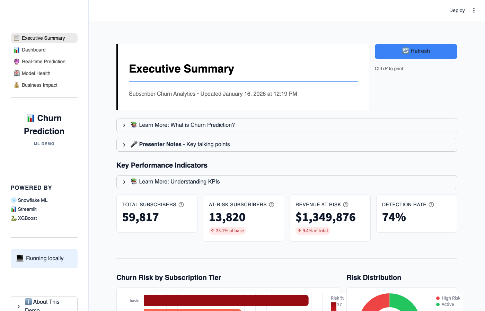
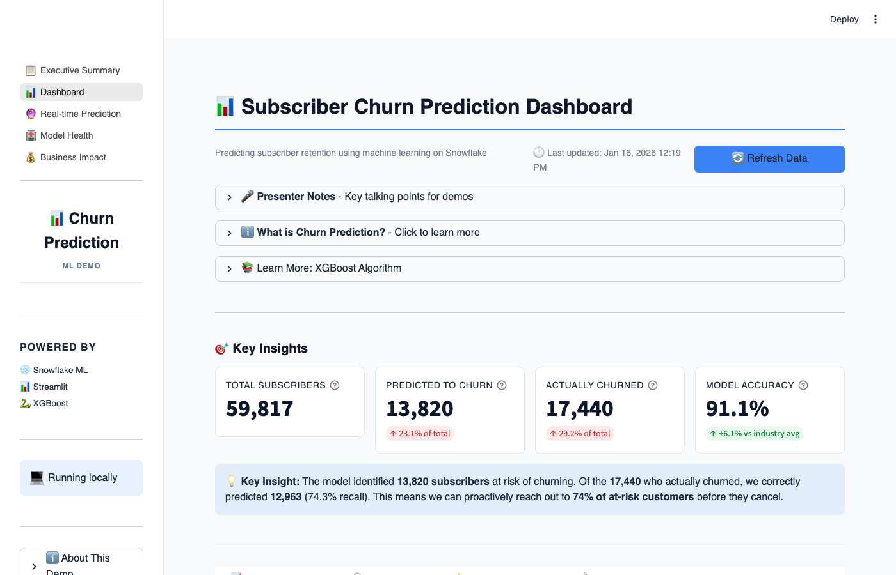
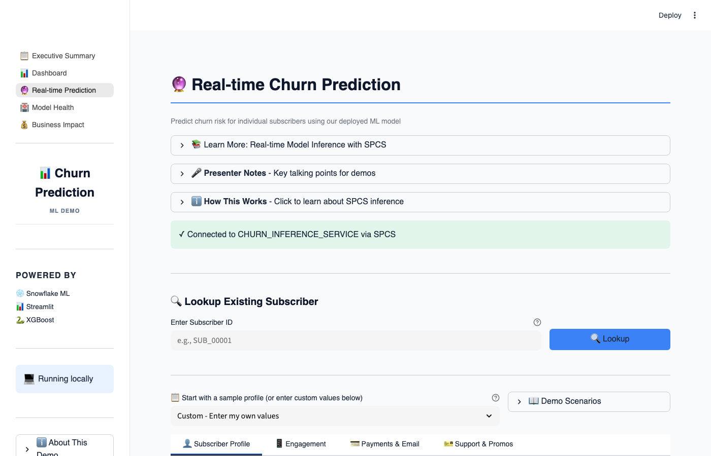
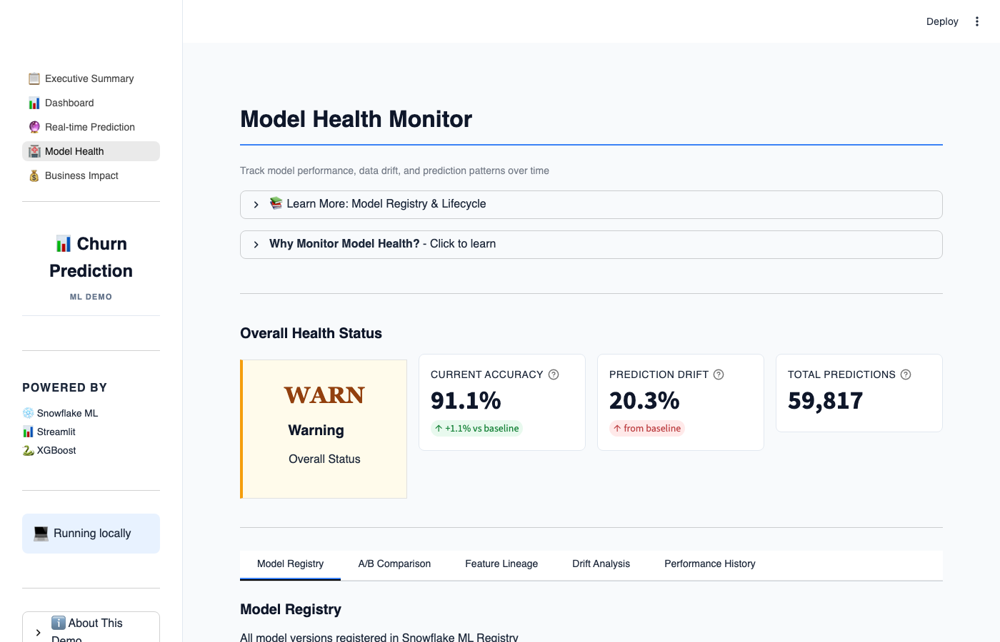
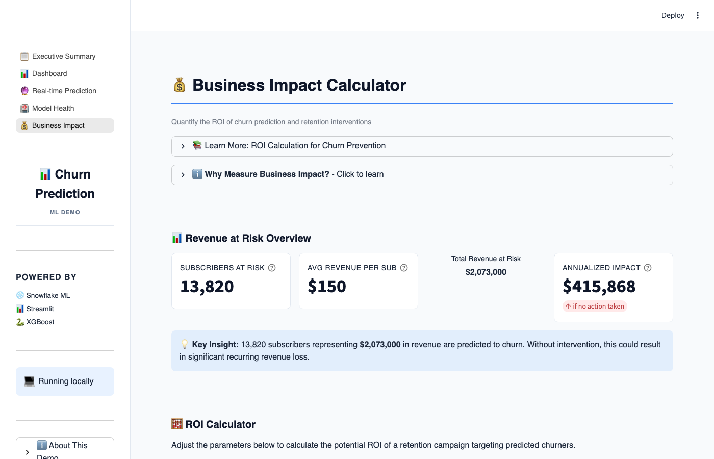

# Subscriber Churn Prediction Demo

## Summary

**TL;DR**: A complete, production-ready ML pipeline for subscriber churn prediction—built entirely within Snowflake. No external infrastructure, no data movement, no MLOps headaches.

🎯 **The Business Problem**: For subscription businesses, churn is existential. A 300K subscriber base at $12.99/month losing just 1% more customers = $4.7M in lost annual revenue. But predicting churn early enough to intervene? That's where most teams struggle.

🔧 **What This Demo Proves**: You can build the *entire* ML lifecycle inside Snowflake:
- **Feature Engineering** → Dynamic Tables that auto-refresh as data arrives
- **Model Training** → XGBoost in Snowflake Notebooks (Container Runtime with GPU)
- **Model Registry** → Full versioning, lineage tracking, experiment comparison
- **Dual Deployment** → Warehouse (SQL UDF for batch) + SPCS (HTTP service for real-time)
- **Monitoring Dashboard** → Streamlit app with drift detection across 28 features

📊 **Results**: 91% accuracy, 74% recall—catching 3 out of 4 churners before they leave. The Streamlit dashboard lets business users explore predictions, calculate ROI, and export at-risk subscriber lists for retention campaigns.

💡 **Why It Matters**: This isn't a toy example. It's a blueprint for how modern data teams can collapse the ML stack into a single platform—same governance, same security, same SQL interface your analysts already know.

**Tech Stack**: Snowflake Notebooks (Container Runtime) • XGBoost • SHAP • Dynamic Tables • ML Registry • SPCS • Streamlit

---

## Why This Demo Exists

Customer churn is one of the most critical challenges facing subscription-based businesses. When a subscriber cancels, you don't just lose their monthly payment—you lose all future revenue from that customer, plus the acquisition cost you invested to win them. For a company with 300,000 subscribers at $12.99/month, even a 1% reduction in churn translates to **$4.7M in preserved annual revenue**.

This demo was created to showcase how Snowflake's unified platform can solve the entire ML lifecycle for churn prediction—from raw data to production inference—without moving data outside Snowflake or managing external infrastructure. It demonstrates that you can:

- **Build production ML pipelines entirely within Snowflake** using Snowflake Notebooks with Container Runtime, eliminating the need for external compute or data movement
- **Deploy model inference** to both Snowflake Warehouse (for SQL-based batch scoring) and Snowpark Container Services (SPCS) for real-time HTTP endpoints
- **Create automated feature pipelines** using Dynamic Tables that keep your ML features fresh as new data arrives
- **Monitor model health and business impact** through a Streamlit dashboard that connects directly to your Snowflake data

The demo uses realistic subscriber data including payment history, engagement patterns, and behavioral signals to predict which subscribers are likely to churn in the next 30 days—giving your retention team time to intervene with targeted offers or outreach.

## What This Demo Does

This is a complete end-to-end machine learning solution that:

1. **Generates realistic subscriber data** (300K subscribers with payment history, engagement events, and support interactions)
2. **Engineers predictive features** using Dynamic Tables that automatically refresh (tenure, payment consistency, engagement trends, etc.)
3. **Trains an XGBoost classifier** in a Snowflake Notebook running on Container Runtime with GPU support
4. **Registers the model** in Snowflake's ML Registry with full versioning and lineage tracking
5. **Deploys model inference** to both Warehouse (SQL functions) and SPCS (real-time HTTP service)
6. **Provides an interactive Streamlit dashboard** for exploring predictions, monitoring model health, and quantifying business impact

The model achieves **91% accuracy** with a **74% detection rate** (recall), meaning it correctly identifies nearly 3 out of 4 subscribers who will actually churn—giving your business a significant head start on retention efforts.

---

End-to-end ML demo showcasing subscriber churn prediction for **300,000 subscribers** using Snowflake's ML capabilities, deployed entirely on Snowflake Container Runtime.

## Architecture

```
┌────────────────────────────────────────────────────────────────────────────────────────┐
│                                  Snowflake Platform                                    │
├────────────────────────────────────────────────────────────────────────────────────────┤
│                                                                                        │
│  ┌─────────────────┐   ┌─────────────────┐   ┌──────────────────────────────────────┐  │
│  │   Raw Data      │   │  Feature Store  │   │             ML Schema                │  │
│  │   (RAW)         │──▶│   (FEATURES)    │──▶│                                      │  │
│  │  300k subs      │   │  Dynamic Tables │   │  ┌────────────────────────────────┐  │  │
│  └─────────────────┘   └─────────────────┘   │  │           Notebook             │  │  │
│                                              │  │      (Container Runtime)       │  │  │
│                                              │  └───────────────┬────────────────┘  │  │
│                                              │                  │                   │  │
│                                              │                  ▼                   │  │
│                                              │  ┌────────────────────────────────┐  │  │
│                                              │  │          ML Registry           │  │  │
│                                              │  │            (Model)             │  │  │
│                                              │  └───────────────┬────────────────┘  │  │
│                                              │                  │                   │  │
│                                              │                  ▼                   │  │
│                                              │  ┌────────────────────────────────┐  │  │
│                                              │  │       Model Deployment         │  │  │
│  ┌────────────────────────────────────────┐  │  │    • Warehouse (SQL UDF)       │  │  │
│  │          Streamlit App                 │◀─┼──│    • SPCS (HTTP Service)       │  │  │
│  │        (Container Runtime)             │  │  └────────────────────────────────┘  │  │
│  └────────────────────────────────────────┘  │                                      │  │
│                                              └──────────────────────────────────────┘  │
│                                                                                        │
└────────────────────────────────────────────────────────────────────────────────────────┘
```

## Quick Start

### Step 0: Configure Environment

1. **Create a Snowflake connection** (if you don't have one):
   ```bash
   snow connection add
   ```

2. **Copy and edit the environment file**:
   ```bash
   cp .env.example .env
   ```
   
   Edit `.env` with your values:
   ```
   SNOWFLAKE_CONNECTION_NAME=your_connection_name  # from `snow connection list`
   SNOWFLAKE_WAREHOUSE=YOUR_WAREHOUSE
   SNOWFLAKE_COMPUTE_POOL=YOUR_COMPUTE_POOL
   ```

3. **Test your configuration**:
   ```bash
   source .env && snow sql -q "SELECT CURRENT_USER()" -c $SNOWFLAKE_CONNECTION_NAME
   ```

All scripts automatically read from `.env` - no additional configuration needed.

### Step 1: Create Database and Tables

Run `setup.sql` with ACCOUNTADMIN (or role with CREATE DATABASE privileges):

```bash
snow sql -f setup.sql -c <your_connection>
```

This creates:
- Database: `CHURN_PREDICTION_DEMO`
- Schemas: `RAW`, `STAGING`, `FEATURES`, `ML`
- Tables: `SUBSCRIBERS`, `PAYMENTS`, `ENGAGEMENT_EVENTS`, etc.
- External Access Integration: `PYPI_ACCESS` (for pip install in notebooks)

### Step 2: Generate Sample Data

**Option A: Quick setup (10k subscribers, ~2 min)**
```bash
cd scripts
python generate_data_quick.py
```

**Option B: Full dataset (300k subscribers, ~30 min)**
```bash
cd scripts
python generate_data.py
```

Both options populate the RAW tables with synthetic subscriber data. Use the quick option for faster iteration during development.

### Step 3: Deploy Notebook (Container Runtime)

Run `setup_notebook.sql` with SYSADMIN:

```bash
# First upload the notebook to stage
snow stage copy notebooks/churn_prediction.ipynb @CHURN_PREDICTION_DEMO.ML.NOTEBOOKS --overwrite -c <your_connection>

# Then run setup script
snow sql -f setup_notebook.sql -c <your_connection>
```

This creates:
- Compute Pool: `CHURN_MODEL_POOL` (CPU_X64_L, auto-suspend 5 min)
- Notebook: `CHURN_PREDICTION_DEMO.ML.CHURN_PREDICTION_NOTEBOOK`

Note: The notebook is configured to use `PYPI_ACCESS` integration (created in setup.sql) for pip install support.

### Step 4: Run the Notebook

Open in Snowsight and run all cells:
1. Creates Feature Store dynamic tables (28 features)
2. Trains XGBoost model with time-based split
3. Registers model to ML Registry
4. Deploys to Warehouse (SQL) and SPCS (HTTP service)
5. Generates batch predictions

### Step 5: Deploy Streamlit Dashboard

```bash
./scripts/deploy_streamlit.sh
```

## Features

- **XGBoost Classifier** trained on subscriber behavior data (300k subscribers)
- **Snowflake Feature Store** with 5 dynamic feature tables (28 features total)
- **SHAP Explainability** for understanding feature importance
- **Snowflake ML Registry** for model versioning and deployment
- **Dual Model Deployment** to Warehouse (SQL) and SPCS (HTTP service) for flexible inference
- **Educational Streamlit Dashboard** running on Container Runtime with:
  - Modern UI design
  - Executive summary for leadership KPI overview
  - Interactive model performance metrics and visualizations
  - ML concepts explained with expandable educational sections
  - Real-time prediction interface with sample profiles
  - Model health monitoring with feature drift detection (all 28 features)
  - Business impact calculator with ROI analysis
  - CSV export for at-risk subscriber lists

## Screenshots

### 📋 Executive Summary
One-page KPI overview for leadership with key metrics (59,817 subscribers, 13,820 at-risk), risk analysis by tier, and recommended actions.



### 📊 Dashboard
Overview of model performance with 91.1% accuracy, feature importance analysis, confusion matrix, and educational content explaining churn prediction concepts.



### 🔮 Real-time Prediction
Interactive wizard-style form to predict churn risk for individual subscribers. Includes sample profiles, feature explanations, and SPCS model integration.



### 🏥 Model Health Monitor
Track model performance with feature drift detection across all 28 features. Statistics computed via Snowflake aggregations on full dataset (no sampling).



### 💰 Business Impact Calculator
Quantify the ROI of churn prediction with revenue at risk analysis, intervention cost modeling, and scenario comparisons.



## Project Structure

```
snowflake-e2e-ml-demo/
├── setup.sql                         # Database, schemas, tables, EAI
├── setup_notebook.sql                # Compute pool, notebook setup
├── .env.example                      # Environment template (copy to .env)
├── notebooks/
│   ├── churn_prediction.ipynb        # Main ML notebook
│   └── requirements.txt              # Notebook pip dependencies
├── streamlit/
│   ├── streamlit_app.py              # Multi-page app entry point
│   ├── pyproject.toml                # Dependencies (uv)
│   ├── environment.yml               # Conda environment for SiS
│   ├── assets.py                     # Shared UI components
│   ├── ml_explanations.py            # ML concept explanations
│   ├── .streamlit/
│   │   └── config.toml               # Theme configuration
│   └── pages/
│       ├── executive_summary.py      # Executive KPI overview
│       ├── dashboard.py              # Dashboard with educational content
│       ├── predict.py                # Real-time prediction wizard
│       ├── model_health.py           # Model monitoring & drift detection
│       └── business_impact.py        # ROI calculator & business metrics
├── scripts/
│   ├── generate_data.py              # Full data generator (300k subscribers)
│   ├── generate_data_quick.py        # Quick data generator (10k subscribers)
│   ├── deploy_notebook.sh            # Notebook deployment
│   ├── deploy_streamlit.sh           # Streamlit deployment
│   ├── pull_notebook.sh              # Pull notebook from Snowflake
│   ├── capture_screenshots.py        # Screenshot automation (Playwright)
│   └── debug_mvrun_spcs.py           # Debug script for mv.run() issue
└── docs/
    └── *.png                         # Screenshots
```

## Snowflake Objects Created

| Object | Type | Location |
|--------|------|----------|
| Database | DATABASE | `CHURN_PREDICTION_DEMO` |
| Compute Pool | COMPUTE_POOL | `CHURN_MODEL_POOL` |
| Network Rule | NETWORK_RULE | `CHURN_PREDICTION_DEMO.ML.PYPI_NETWORK_RULE` |
| External Access | INTEGRATION | `PYPI_ACCESS` |
| Notebook | NOTEBOOK | `CHURN_PREDICTION_DEMO.ML.CHURN_PREDICTION_NOTEBOOK` |
| Streamlit | STREAMLIT | `CHURN_PREDICTION_DEMO.ML.CHURN_DASHBOARD` |
| Model | MODEL | `CHURN_PREDICTION_DEMO.ML.CHURN_PREDICTION_MODEL` |
| Inference Service | SERVICE | `CHURN_PREDICTION_DEMO.ML.CHURN_INFERENCE_SERVICE` |
| Warehouse Deploy | FUNCTION | `CHURN_PREDICTION_DEMO.ML.CHURN_WH_DEPLOY` |

## Prerequisites

- Snowflake account with:
  - Container Runtime enabled
  - ACCOUNTADMIN access (for initial setup)
  - SYSADMIN access (for notebook/streamlit)
- Snowflake CLI (`snow`) installed and configured with a connection
- Python 3.10+ (for data generation)

## Local Development

To run the Streamlit app locally for development:

```bash
# Ensure your .env file is configured with SNOWFLAKE_CONNECTION_NAME
source .env  # or: export SNOWFLAKE_CONNECTION_NAME=your_connection_name

cd streamlit
streamlit run streamlit_app.py
```

The app will automatically use your Snowflake connection for local development, or detect Snowsight's session when deployed.

## Technology Stack

- **ML Framework**: XGBoost via Snowflake ML
- **Model Registry**: Snowflake ML Registry
- **Model Serving**: Warehouse (SQL UDF) + Snowpark Container Services (SPCS)
- **Dashboard**: Streamlit on Container Runtime
- **Explainability**: SHAP
- **Visualization**: Altair

## Future Enhancements

### Optional: Recency Gap for Churners
The data generator could be enhanced to create a guaranteed "silence period" before churn - ensuring churners have no engagement events in their final 30 days. This would strengthen the "days since last engagement" signal for the model. Currently, the decay logic reduces event count but events can still occur close to churn date.

## Known Issue: mv.run() vs SQL-based SPCS Inference

When using `ModelVersion.run()` with a Snowpark DataFrame for SPCS inference, we observed significant accuracy degradation (~50%) compared to direct SQL inference (~88%). 

### Root Cause: Non-Deterministic Row Ordering

After debugging (see [`scripts/debug_mvrun_spcs.py`](scripts/debug_mvrun_spcs.py)), we identified the root cause:

**The Problem:** Snowpark DataFrames have **non-deterministic row ordering**. When `mv.run()` creates an internal temp table for SPCS inference, it returns rows in a different order than when you call `.to_pandas()` on the same DataFrame. The predictions are correct, but they're matched to the **wrong rows**.

**Evidence (sample size 5,000 using exact notebook data pipeline):**
```
Baseline mv.run() (no order): 50.14%  ❌ (basically random!)
Baseline SQL:                 88.42%  ✅

Same SUBSCRIBER_IDs returned? False
  First 3 from to_pandas(): ['ff8a6f79-...', 'd4ca9983-...', 'b438735e-...']
  First 3 from SQL:         ['b08e3c99-...', '4db85e85-...', 'a220b0ba-...']
```

### Why Does This Happen?

#### 1. SQL Has No Guaranteed Row Order Without ORDER BY

In Snowflake (and all SQL databases), **without an explicit `ORDER BY`, row order is non-deterministic**. The database returns rows in whatever order is most efficient for that particular execution.

```python
# These two executions can return DIFFERENT rows in DIFFERENT order:
df.limit(100).to_pandas()      # Execution 1: might return rows A, B, C...
df.limit(100).to_pandas()      # Execution 2: might return rows X, Y, Z...
```

#### 2. Snowpark DataFrames Are Lazily Evaluated

Snowpark DataFrames don't hold data - they hold a **query plan**. Each time you call `.to_pandas()`, `.collect()`, or pass to `mv.run()`, it executes a **new query**:

```python
sample = test_data.limit(500)  # Just stores query plan, no execution yet

# These are TWO SEPARATE SQL EXECUTIONS:
predictions = mv.run(sample.select(features))  # Execution 1
actuals = sample.select('CHURNED').to_pandas()  # Execution 2 - DIFFERENT ROWS!
```

#### 3. What mv.run() Does Internally

When you call `mv.run(df)`, it:
1. Creates an **internal temporary table** from your DataFrame
2. Executes the SPCS service function against that temp table
3. Returns results

The problem:
```
Your DataFrame ──► mv.run() creates temp table ──► Returns predictions
       │                (Execution A - rows in order X)
       │
       └──────────► .to_pandas() ──► Returns actuals  
                        (Execution B - rows in order Y)
                              
X ≠ Y  →  Predictions don't match actuals!
```

#### 4. Visual Example

```python
# Without ORDER BY - each query returns different random subset
sample = test_data.limit(5)

# Execution 1 (mv.run internally)
# Returns: [Row3, Row7, Row1, Row9, Row2]  →  Predictions: [0, 1, 1, 0, 1]

# Execution 2 (to_pandas)  
# Returns: [Row5, Row2, Row8, Row1, Row4]  →  Actuals: [1, 1, 0, 1, 0]

# Comparing predictions[0] with actuals[0] is comparing Row3 with Row5!
# Result: ~50% accuracy (random chance)
```

#### 5. Why ORDER BY Fixes It

```python
# With ORDER BY - both queries return SAME rows in SAME order
sample = test_data.order_by('SUBSCRIBER_ID').limit(5)

# Execution 1 (mv.run internally)
# ORDER BY SUBSCRIBER_ID → Returns: [Row1, Row2, Row3, Row4, Row5]

# Execution 2 (to_pandas)
# ORDER BY SUBSCRIBER_ID → Returns: [Row1, Row2, Row3, Row4, Row5]

# Now predictions[0] matches actuals[0] (both are Row1)
# Result: ~88% accuracy (correct)
```

#### 6. Why SQL-based SPCS Works

SQL keeps everything in **one execution**:

```sql
SELECT 
    SUBSCRIBER_ID,
    CHURNED,                          -- Actual (same row)
    SERVICE!PREDICT(...):PREDICTION   -- Prediction (same row)
FROM my_table
```

The prediction and actual are computed **in the same query**, so they're always from the same row - no misalignment possible.

### Tested Fixes (sample size: 5,000)

| Method | Accuracy | Notes |
|--------|----------|-------|
| Baseline mv.run() (no ordering) | 50.14% | ❌ Basically random due to row misalignment |
| **ORDER BY + mv.run()** | 88.48% | ✅ Add `.order_by('SUBSCRIBER_ID')` before operations |
| **Temp Table + mv.run()** | 88.48% | ✅ Materialize to temp table first |
| **Warehouse mv.run()** | 88.48% | ✅ Remove `service_name` parameter |
| **SQL-based SPCS** | 88.42% | ✅ Current workaround in notebook |

### Fix 1: ORDER BY (Recommended)

```python
# ❌ BROKEN: No deterministic ordering
sample = test_data.limit(500)
feature_only = sample.select(feature_cols)
predictions = mv.run(feature_only, function_name='predict', service_name='CHURN_INFERENCE_SERVICE')
actuals = sample.select('CHURNED').to_pandas()  # Different rows returned!

# ✅ FIXED: Add ORDER BY before any operations
sample = test_data.order_by('SUBSCRIBER_ID').limit(500)
feature_only = sample.select(feature_cols)
predictions = mv.run(feature_only, function_name='predict', service_name='CHURN_INFERENCE_SERVICE')
actuals = sample.order_by('SUBSCRIBER_ID').select('CHURNED').to_pandas()  # Same rows!
```

### Fix 2: Materialize to Temp Table

```python
# ✅ FIXED: Materialize DataFrame first
sample = test_data.order_by('SUBSCRIBER_ID').limit(500)
sample.write.mode('overwrite').save_as_table('MY_TEMP_TABLE', table_type='temporary')

materialized = session.table('MY_TEMP_TABLE')
feature_only = materialized.order_by('SUBSCRIBER_ID').select(feature_cols)
predictions = mv.run(feature_only, function_name='predict', service_name='CHURN_INFERENCE_SERVICE')
actuals = materialized.order_by('SUBSCRIBER_ID').select('CHURNED').to_pandas()
```

### Fix 3: Use Warehouse Instead of SPCS

```python
# ✅ FIXED: Warehouse inference (no service_name)
predictions = mv.run(feature_only, function_name='predict')  # No service_name = warehouse
```

### Fix 4: SQL-based SPCS (Current Workaround)

```sql
-- ✅ FIXED: SQL keeps predictions aligned with row identifiers
SELECT 
    SUBSCRIBER_ID,
    CHURNED as ACTUAL,
    CHURN_INFERENCE_SERVICE!PREDICT(...):PREDICTION::INT as PREDICTED
FROM my_table
```

### Switching Back to mv.run()

If you want to switch from SQL-based SPCS back to `mv.run()`, use this pattern:

```python
def batch_predict_with_mvrun(test_df, model_version, feature_cols):
    """Batch predictions using mv.run() with proper row ordering."""
    
    # KEY FIX: Order by unique ID to ensure deterministic row order
    ordered_df = test_df.order_by('SUBSCRIBER_ID')
    
    # Run predictions via SPCS
    predictions = model_version.run(
        ordered_df.select(feature_cols),
        function_name='predict',
        service_name='CHURN_INFERENCE_SERVICE'
    )
    
    # Get actuals with same ordering
    actuals = ordered_df.select('SUBSCRIBER_ID', 'CHURNED')
    
    # Join predictions back to actuals by position (now aligned!)
    pred_pd = predictions.to_pandas()
    actual_pd = actuals.to_pandas()
    
    result = actual_pd.copy()
    result['PREDICTED_CHURN'] = pred_pd['PREDICTION'].values
    
    return result

# Usage:
result_df = batch_predict_with_mvrun(test_with_id, loaded_model, feature_cols)
accuracy = (result_df['PREDICTED_CHURN'] == result_df['CHURNED']).mean()
```

### SQL vs mv.run() Performance

Both approaches use the **same SPCS inference service** and have similar performance:

| Aspect | SQL-based SPCS | mv.run() with SPCS |
|--------|----------------|-------------------|
| **Underlying compute** | SPCS container | SPCS container |
| **Inference speed** | Same | Same |
| **Overhead** | Minimal (direct SQL) | Slightly more (creates temp table) |
| **Row alignment** | ✅ Automatic | ⚠️ Requires ORDER BY |
| **Recommendation** | ✅ Simpler, safer | Use if you need DataFrame API |

**Note**: Both SQL and mv.run() with SPCS use Feature Store data. The notebook creates `test_with_id` from Feature Store enriched data, then either:
- SQL: Creates temp view and queries with `SERVICE!PREDICT()`
- mv.run(): Passes DataFrame to `model.run(service_name='...')`

### Debug Script

Run the debug script to reproduce and test fixes:
```bash
cd scripts
SNOWFLAKE_CONNECTION_NAME=your_connection python debug_mvrun_spcs.py
```

---

## Troubleshooting

### Notebook won't run on Container Runtime
- Ensure ownership is transferred to SYSADMIN (ACCOUNTADMIN-owned notebooks can't use Container Runtime)
- Verify compute pool is running: `DESCRIBE COMPUTE POOL CHURN_MODEL_POOL`

### SPCS inference service not responding
- Check service status: `SHOW SERVICES IN SCHEMA CHURN_PREDICTION_DEMO.ML`
- View logs: `SELECT SYSTEM$GET_SERVICE_LOGS('CHURN_PREDICTION_DEMO.ML.CHURN_INFERENCE_SERVICE', 0, 'model-server')`

### Streamlit app errors
- Verify External Access Integration is attached
- Check compute pool has available capacity

---

## License

This project is licensed under the Apache License 2.0 - see the [LICENSE](LICENSE) file for details.

## Repository Owner

- **Owner:** John Kang (john.kang@snowflake.com / [@sfc-gh-jkang](https://github.com/sfc-gh-jkang))
- **Access requests:** Open a [CASEC Jira](https://snowflakecomputing.atlassian.net/) for access changes
- **License:** Apache-2.0

